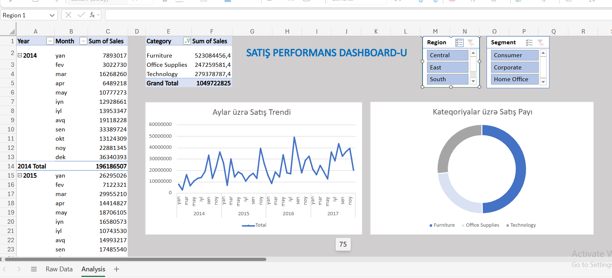

# Superstore Sales Analytics Dashboard

An interactive corporate dashboard built using the Kaggle Superstore Sales dataset. This project focuses on processing raw retail transactional records, identifying monthly sales trends, and visualizing product segment performance for executive reporting.

## 📊 Project Layout & Dashboard Preview
> **Note on Slicer Automation:** The custom slicer connections are configured for local desktop environment processing due to Excel Online file-cache limits.

## 🎯 What I Did: Data Analytics Steps

### 1. Data Cleaning & Preparation (Data Hygiene)
* **Tabular Structuring:** Analyzed the raw transactional ledger to ensure column alignment and data consistency.
* **Date Standardization:** Standardized the `Order Date` fields into logical `Year` and `Month` hierarchies to make chronological tracking possible.
* **Formatting Cleanup:** Cleaned up numerical display noise by truncating unnecessary decimals (removing `.00` values) to make numbers clean and readable.
* **Abbreviation Adjustment:** Compressed long month strings into short, clean labels (`yan`, `fev`, `mar`) to optimize chart space.

### 2. Analytical Modeling (Pivot Tables)
* **Trend Analysis Matrix:** Engineered a master Pivot Table aggregating temporal trends—calculating absolute `Sum of Sales` across a multi-year period.
* **Product Segmentation Matrix:** Built a secondary structural matrix focusing on product portfolio distribution (`Furniture`, `Office Supplies`, `Technology`) to monitor category volume.

### 3. Dashboard Design & UI/UX Optimization
* **Theme Uniformity:** Adopted a polished, dark-blue and slate gray corporate theme to replace standard generic Excel colors.
* **Line Chart (Sales Trend):** Created an elegant Line Chart showcasing historical spikes, dips, and monthly revenue behavior.
* **Doughnut Chart (Category Contribution):** Designed a Doughnut Chart to provide stakeholders with an immediate visual grasp of product market shares.
* **Interactive Filtering (Slicers):** Embedded dynamic Slicers (`Region` and `Segment`) directly onto the main vərəq to support multi-dimensional ad-hoc filtering.

## 🛠️ Technical Stack
* **Software:** Microsoft Excel (Advanced Pivot Tables, Pivot Charts, Interactive Slicers, Custom Number Formatting).
* **Data Source:** Kaggle Superstore Sales Dataset.

## 📂 Repository Contents
* `sample-supertose 1.xlsx` - The main spreadsheet containing Raw Data, Analytics, and the visual Dashboard layout.
* `dashboard.png` - A high-resolution snapshot of the final reporting dashboard.
